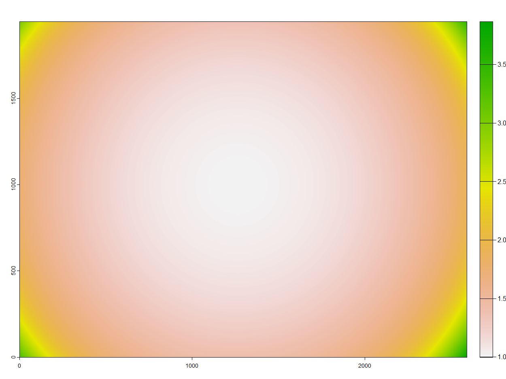

# DJI Mavic 3M image processing
Augustin Debly

## DJI Mavic 3M

## Packages
This code is designed in R but it has to use Python functions from opencv library. Another full Python version will be designed later. The packages needed in R are exiftoolr (for images metadata reading), terra and shiny. `install_exiftool()` is a function from exiftoolr that install [exiftool](https://exiftool.org) and has to be launched once. The packages needed in Python are numpy and opencv. Make sure you have [Python](https://www.python.org/) installed on your machine.

```{r}
##R packages
require(exiftoolr)
require(terra)
require(shiny)
#install_exiftool()

##Python packages
system("python -m pip install numpy")
system("python -m pip install opencv-python")
```

## Path definition

## Geometric processing
### Step 1 : Vignetting correction
The first step is to correct the vignetting effect from the raw images. A 2D polynomial function is given by DJI for each image of each band to homogenize the brightness of the image : 
$$P(x,y) = \sum_{i=1}^6 c_ir^i(x,y)$$
Where :
$$r(x,y) = \sqrt{\(x-C_x\)^2+\(y-C_y\)^2}$$
$C_x$ and $C_y$ are the center coordinates of the image in $x$ and $y$ direction, respectively. $x$, $y$, $C_x$ and $C_y$ are expressed in number of pixels (unitless). Each pixel of the raw image has to be multiplied by the polynomial value corresponding to this pixel.  

* **In R**, you first need to import the constants from the metadata using exiftoolr functions :

```{r}
exif_image = exif_read(path_to_the_image)

Cx = exif_image$VignettingCenter[[1]][1]
Cy = exif_image$VignettingCenter[[1]][2]

c1 = exif_image$VignettingPolynomial[[1]][1]
c2 = exif_image$VignettingPolynomial[[1]][2]
c3 = exif_image$VignettingPolynomial[[1]][3]
c4 = exif_image$VignettingPolynomial[[1]][4]
c5 = exif_image$VignettingPolynomial[[1]][5]
c6 = exif_image$VignettingPolynomial[[1]][6]

height = exif_image$ImageHeight
width  = exif_image$ImageWidth
```

* You also need to define the $P(x,y)$ function :

```{r}
polynomial_correction <- function(x,y,Cx,Cy,c1,c2,c3,c4,c5,c6){
  r = sqrt((x-Cx)^2+(y-Cy)^2)
  return(1+c1*(r^1)+c2*(r^2)+c3*(r^3)+c4*(r^4)+c5*(r^5)+c6*(r^6))
}
```

* Create a matrix which has the same size as the image, containing the $P(x,y)$ values :

```{r}
x_mat = matrix(rep(1:width,each=height),ncol=width)
y_mat = matrix(rep(1:height,times=width),ncol=width)

matrice_vignetting = polynomial_correction(x_mat,y_mat,Cx,Cy,c1,c2,c3,c4,c5,c6)
```

Check out the matrix values with `plot(rast(matrice_vignetting))` :

<p align="center">
    
</p>

* Multiply the raw image by the matrix, previously transformed into SpatRaster :

```{r}
image_corrected_vignetting = rast(path_to_the_image)*rast(matrice_vignetting)
```

* The raw image pixels are typically encoded as UInt16, resulting in a range of values from 0 to 65535. The corrected image must maintain this value range, with each pixel adjusted according to a linear relationship. The polynomial correction also introduces float values, necessitating the transformation of the corrected image back into integers after the range correction :

```{r}
max_raw       = max(values(rast(path_to_the_image)))
min_raw       = min(values(rast(path_to_the_image)))

max_corrected = max(values(image_corrected_vignetting))
min_corrected = min(values(image_corrected_vignetting))

a             = (max_raw-min_raw)/(max_corrected-min_corrected)
b             = min_raw - a * min_corrected

image_corrected_vignetting         = a * image_corrected_vignetting + b
values(image_corrected_vignetting) = as.integer(values(image_corrected_vignetting))
```

* Finally, the corrected image can be written to the corresponding path :

```{r}
writeRaster(image_corrected_vignetting,path_step_1,datatype = datatype(rast(path_to_the_image)),overwrite=T)
```

### Step 2 : Distorsion correction
Now you want to correct the distorsion of your images. To do so, the `undistort()` function from opencv in Python is used. It needs the camera matrix

$$K = 
\begin{bmatrix}
  f_x & 0 & c_x \\
  0 & f_y & c_y \\
  0 & 0 & 1 \\
\end{bmatrix}
$$

and the distorsion coefficients vector

$$D = \begin{bmatrix}
  k_1 & k_2 & p_1 & p_2 & k_3 & k_4=0 & k_5=0 & k_6=0 \\
\end{bmatrix}$$

as arguments to correct the image.

<details>
<summary>Optical explanations</summary>

The model used here is a [modified pinhole model](https://www.opencv.org.cn/opencvdoc/2.3.2/html/modules/calib3d/doc/camera_calibration_and_3d_reconstruction.html?highlight=solvepnp) used by opencv. Let's introduce the coordinates of a given point in the "world" reference system

<p align="center">
    
</p>

And in the camera reference system, centered and oriented according to the pinhole (in our case, the lens)

<p align="center">
    
</p>

Both are connected through the projection matrix P

<p align="center">
    
</p>

Which is a combination of a 3x3 rotation matrix and a 3x1 translation vector

<p align="center">
    
</p>

<p align="center">
    
</p>

<p align="center">
    
</p>

<p align="center">
    
</p>

<p align="center">
    
</p>

</details>

### Step 3 : Alignment correction

### Step 4 : ECC alignment correction

### Step 5 : Homogenization

## Spectral processing

### Step 6 : Digital Number (DN) to radiance

### Step 7 : Radiance to reflectance
